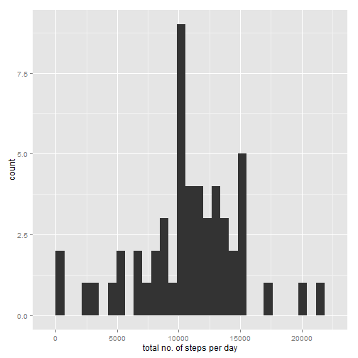
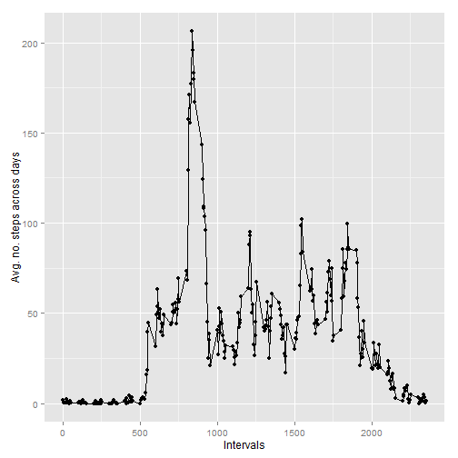
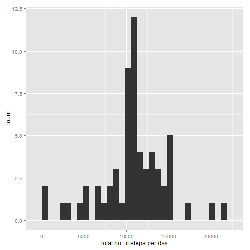
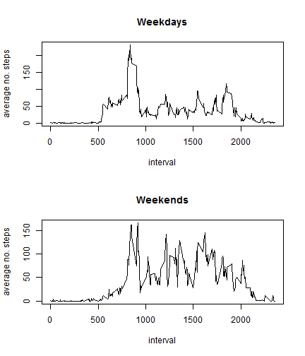

Report of RepData_PeerAssessment1 
========================================================
This document is the report for Assignment 1 of the Coursera course on Reproducible Research.  

Set your working directory to the directory containing the file activity.csv with the data. Read the data into R:

```r
data <- read.csv("activity.csv")
```

Now, we calulate the total number of steps taken each day:

```r
tot_steps <-tapply(data$steps,data$date,FUN="sum")
tot_steps<-as.data.frame(tot_steps)
```

Let's take a look at the distribution of the total number of steps with an histogram:

```r
library(ggplot2)
qplot(tot_steps,data=tot_steps,xlab="total no. of steps per day")
```

 

We now calculate the mean and the median number of steps per day:

```r
mean(tot_steps$tot_steps,na.rm=TRUE)
```

```
## [1] 10766.19
```

```r
median(tot_steps$tot_steps,na.rm=TRUE)
```

```
## [1] 10765
```

Now we calculate the average number of steps taken at each 5-minute interval, averaged across all days:

```r
mean_int<-tapply(data$steps,data$interval,FUN="mean",na.rm=TRUE)
mean_int<-as.data.frame(mean_int)
```
And we plot the time trend:

```r
print(ggplot(data=mean_int,aes(x=as.integer(row.names(mean_int)),y=mean_int))+geom_line()+geom_point()+xlab("Intervals")+ylab("Avg. no. steps across days"))
```

 

The maximum number of steps is

```r
max(mean_int$mean_int)
```

```
## [1] 206.1698
```
and it occurs at the time interval:

```r
row.names(mean_int)[mean_int$mean_int==max(mean_int$mean_int)]
```

```
## [1] "835"
```
The dataset contains missing values for some intervals. The total number of missing values is:

```r
sum(is.na(data$steps))
```

```
## [1] 2304
```
We fill in missing values with the average number of steps of that 5-minutes interval, averaged across all days. We create a new dataset called data_fill where missing values have been replaced:

```r
data_fill <- data
rep_mat<-rep(mean_int$mean_int,times=61)
rep_mat<-as.data.frame(rep_mat)
data_fill$steps[is.na(data$steps)]<-rep_mat$rep_mat[is.na(data$steps)]
```
Now, we calulate the total number of steps taken each day and take a look at its distribution:

```r
tot_steps_fill <-tapply(data_fill$steps,data_fill$date,FUN="sum")
tot_steps_fill<-as.data.frame(tot_steps_fill)
qplot(tot_steps_fill$tot_steps_fill,data_fill=tot_steps_fill,xlab="total no. of steps per day")
```

 
  
The mean and median number of steps per day after replacing missing values are:

```r
mean(tot_steps_fill$tot_steps_fill)
```

```
## [1] 10766.19
```

```r
median(tot_steps_fill$tot_steps_fill)
```

```
## [1] 10766.19
```
The histograms show that, after imputing missing values, the central peaks of count of number of steps per day have increased. This is due to the fact that for a total of 8 days missing values were replaced with averaged values (central peaks). The average number of steps per day is left unchanged because we replaced missing values by the average. The median has slightly increased and now coincides with the mean because we have several days whose sum of steps is the average. 
  
We now add a a factor to distinguish weekdays from weekends:

```r
data_fill$date<-as.Date(data_fill$date)
data_fill$weekday <-weekdays(data_fill$date)
data_fill$weekday<-sub("sabato", "weekend", data_fill$weekday)
data_fill$weekday<-sub("domenica", "weekend", data_fill$weekday)
data_fill$weekday<-sub("lunedì", "weekday", data_fill$weekday)
data_fill$weekday<-sub("martedì", "weekday", data_fill$weekday)
data_fill$weekday<-sub("mercoledì", "weekday", data_fill$weekday)
data_fill$weekday<-sub("giovedì", "weekday", data_fill$weekday)
data_fill$weekday<-sub("venerdì", "weekday", data_fill$weekday)
data_fill$weekday<-as.factor(data_fill$weekday)
```
We compute the average number of steps per 5-minutes interval, averaged across weekdays and weekends separately, and plot them as time series:

```r
data_split <- split(data_fill,data_fill$weekday)
mean_wday<-tapply(data_split$weekday$steps,data_split$weekday$interval,FUN="mean")
mean_wend<-tapply(data_split$weekend$steps,data_split$weekend$interval,FUN="mean")
mean_wend<-as.data.frame(mean_wend)
mean_wday<-as.data.frame(mean_wday)
par(mfrow = c(2, 1))
plot(as.integer(row.names(mean_wday)),mean_wday$mean_wday,main="Weekdays",xlab="interval",ylab="average no. steps",type="l")
plot(as.integer(row.names(mean_wend)),mean_wend$mean_wend,main="Weekends",xlab="interval",ylab="average no. steps",type="l")
```

 
